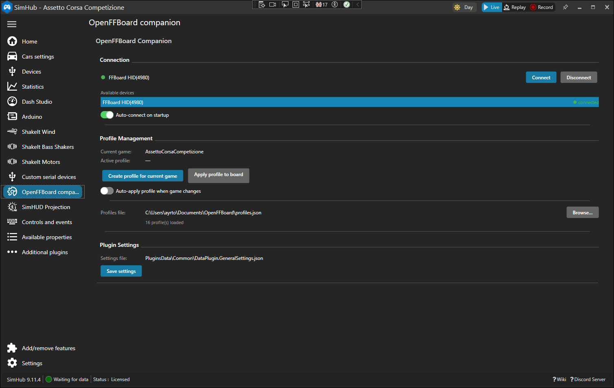

# OpenFFBoard Plugin for SimHub

[](https://github.com/AyrtonRicardo/openffboard-pluginsdk/actions/workflows/build.yml)
[](https://codecov.io/gh/AyrtonRicardo/openffboard-pluginsdk)

A SimHub plugin that connects [OpenFFBoard](https://github.com/Ultrawipf/OpenFFBoard) force-feedback hardware to SimHub, enabling per-game FFB profiles that are automatically applied when you launch a game.

## Features

- **HID connection** — discovers and connects to OpenFFBoard via USB HID; no serial port configuration required
- **Per-game profiles** — stores FFB settings in a `profiles.json` file; the correct profile is automatically applied when SimHub detects a game change
- **Profile management** — create a new profile for the current game (cloned from the Default profile) or apply an existing one to the board with dedicated buttons
- **Graceful fallback** — if no profile exists for the current game, no changes are sent to the board
- **Robust JSON parsing** — tolerates `{}` (empty object) instead of `[]` (empty array) in the profiles file; safe to use hand-edited JSON

## Supported FFB commands

| Class  | Command        | Description                  |
|--------|----------------|------------------------------|
| `fx`   | `filterCfFreq` | Center-friction filter freq  |
| `fx`   | `filterCfQ`    | Center-friction filter Q     |
| `fx`   | `spring`       | Spring effect strength       |
| `fx`   | `friction`     | Friction effect strength     |
| `fx`   | `damper`       | Damper effect strength       |
| `fx`   | `inertia`      | Inertia effect strength      |
| `axis` | `power`        | Overall FFB power            |
| `axis` | `degrees`      | Steering lock (degrees)      |
| `axis` | `fxratio`      | FX/direct ratio              |
| `axis` | `esgain`       | Endstop gain                 |
| `axis` | `idlespring`   | Idle spring strength         |
| `axis` | `axisdamper`   | Axis damper                  |
| `axis` | `axisfriction` | Axis friction                |
| `axis` | `axisinertia`  | Axis inertia                 |

## Installation

1. Go to [Releases](https://github.com/AyrtonRicardo/openffboard-pluginsdk/releases) and download `OpenFFBoardPlugin.zip`.
2. Extract **all DLLs** from the zip into your SimHub installation folder (default: `C:\Program Files (x86)\SimHub`):
   - `OpenFFBoardPlugin.dll`
   - `OpenFFBSharp.dll`
   - `Hid.Net.dll`
   - `Device.Net.dll`
3. Restart SimHub.
4. Open **Add/Remove features**, search for `OpenFFBoard`, enable it, and check **Show in left menu**.

## Profile file format

The plugin reads a `profiles.json` file whose path you configure in the plugin settings.

```json
{
  "release": 2,
  "profiles": [
    {
      "name": "None",
      "data": []
    },
    {
      "name": "Default",
      "data": [
        { "fullname": "Effects", "cls": "fx",   "instance": 0, "cmd": "spring",  "value": 31   },
        { "fullname": "Axis",    "cls": "axis",  "instance": 0, "cmd": "degrees", "value": 1080 }
      ]
    }
  ]
}
```

- The **`None`** profile is special — selecting it sends no commands to the board.
- The **`Default`** profile is used as the template when creating a new game profile.
- Profile names are matched to game names **case-insensitively**.

## Plugin UI



## Contributing

### Requirements

- Visual Studio 2022
- SimHub installed (sets `SIMHUB_INSTALL_PATH` environment variable)
- .NET Framework 4.8

### Build

```
"C:\Program Files\Microsoft Visual Studio\2022\Community\MSBuild\Current\Bin\MSBuild.exe" OpenFFBoardPlugin.sln /p:Configuration=Debug
```

The post-build event copies output DLLs to `%SIMHUB_INSTALL_PATH%` automatically. If the env var is not set the build still succeeds and only the XCOPY step is skipped.

### Debug

Set the external program target to `C:\Program Files (x86)\SimHub\SimHubWPF.exe` and press F5.

### Adding SimHub dependencies

SimHub DLL references use the `$(SIMHUB_INSTALL_PATH)` MSBuild variable. Do **not** use NuGet for SimHub-provided assemblies — edit the `.csproj` manually. New DLLs must also be added to the post-build XCOPY.

### Adding non-SimHub dependencies

Add via NuGet normally. Then add a corresponding `XCOPY` line to the post-build event so the DLL is deployed to SimHub alongside the plugin.

### Running tests

```
dotnet test OpenFFBoardPlugin.Tests/OpenFFBoardPlugin.Tests.csproj
```

Tests cover JSON loading/saving, the `FlexibleListConverter` (handles `{}` vs `[]`), `ProfileHolder` logic, and fixture-based tests using a real `profiles.json` sample.

## License

MIT
